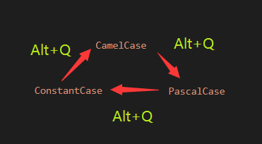
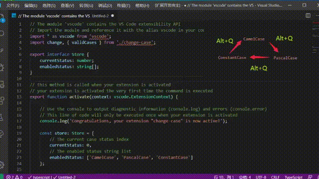
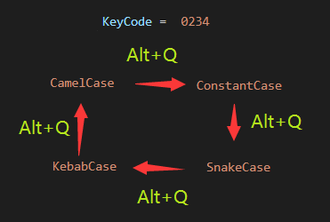
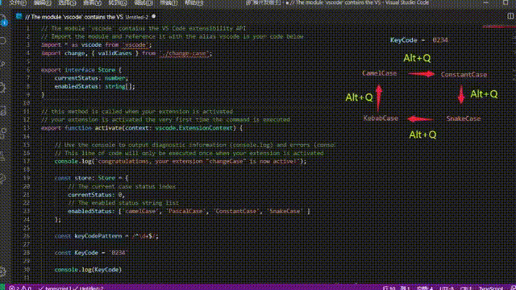

# Change Case README

Quickly change the case with one keybinding

## Features

Switch cases in "camelCase", "PascalCase" and "CONSTANT_CASE" with alt + q (windows) / ctrl + cmd+ c (mac).

You can also switch to "snake_case" and "kebab-case" if you like. You need set the key code by "cmd + shift + P" and use the "Set Key Code" command.

All supported cases are below:

| code | cases |
| -- | -- |
| 0 | camelCase |
| 1 | PascalCase |
| 2 | CONSTANT_CASE |
| 3 | snake_case |
| 4 | kebab-case |

For example, if you set key code to `0234`. The action will be as below:

| operation | times | action |
| -- | -- | -- |
| alt + q | first | to camelCase |
| alt + q | second | to CONSTANT_CASE |
| alt + q | third | to snake_case |
| alt + q | forth | to kebab-case |
| alt + q | fifth | to camelCase (again) |

## Make this extension better

You can pull request on github. Welcome!
